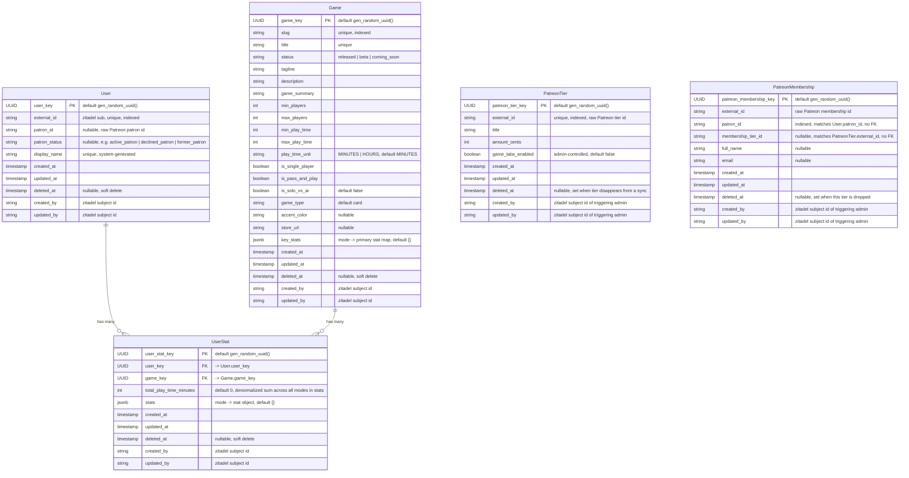
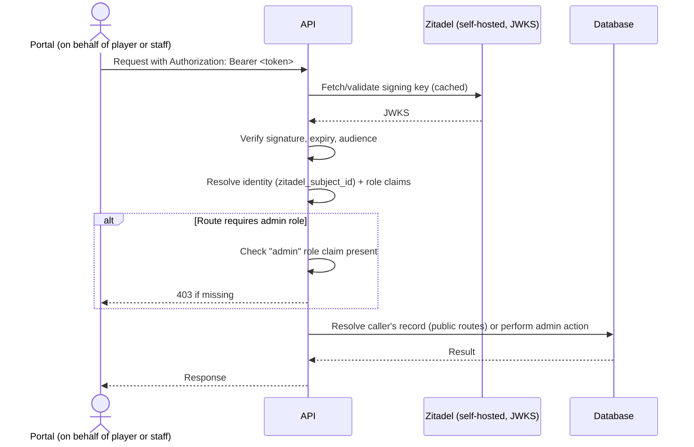

# Technical Architecture

## 1. Overview

The system is a single FastAPI service exposing a REST API over PostgreSQL, with no independent frontend. It has exactly one consumer — a separate portal application — which relays both end-user (player) requests and staff (admin) requests to this API, forwarding the caller's own Zitadel-issued access token on every call.

**Architectural pattern:** Domain-modular monolith. The codebase is organized into top-level domain packages (e.g., users, games, stats, entitlements, patreon), each splitting its API surface into two sibling sub-packages — `public/` (portal-facing, player-scoped) and `admin/` (dashboard-facing, staff-scoped) — rather than collecting all admin logic into a single top-level `admin/` package that mirrors the domain packages from the outside. Each sub-package follows a router → service → data-access layering.

**System boundaries:**
- **In-scope:** this API service and its own application container definition, and the domain logic for users, games, stats, and entitlements.
- **External:** the portal application (sole consumer, out of scope), self-hosted Zitadel (identity/auth, out of scope), Patreon (supporter/tier data source, out of scope), PostgreSQL (backing database, provisioned by the parent project's stack, not by this repo).

**How this serves the product:** the domain-per-package structure gives each capability area (profiles, game listings, stats, entitlements, Patreon sync) an independently reasoned-about home, while the public/admin split inside each domain keeps player-facing and staff-facing concerns from bleeding into each other — directly addressing the requirement to cleanly separate dashboard behavior from portal-facing behavior.

Data model is defined for the `games`, `users`, `stats`, and `patreon` domains (see Data Model) — `entitlements` remains deferred. API route maps and other design details beyond the schema remain out of scope for now — see Technical Gap Analysis.

## 2. Project Structure

### Directory Layout

```
repo-root/
├── app/
│   ├── main.py                    # FastAPI app instantiation; mounts every domain's public + admin routers
│   ├── config.py                  # pydantic-settings application configuration
│   ├── database.py                # psycopg3 AsyncConnectionPool setup (no ORM)
│   ├── core/                      # Cross-cutting infrastructure — not a content domain, no public/admin split
│   │   └── auth/
│   │       ├── dependencies.py    # FastAPI Depends() for token validation + role-gate checks
│   │       ├── jwks.py            # Zitadel JWKS fetch/cache for token verification
│   │       ├── zitadel_client.py  # Zitadel-facing HTTP client (issuer discovery, etc.)
│   │       └── __init__.py
│   ├── users/                     # Domain: player profiles
│   │   ├── model.py                # Hand-written SQL queries + row-mapping for this domain — shared by both public/ and admin/
│   │   ├── public/                 # Portal-facing surface: the calling player acting on their own data
│   │   │   ├── router.py
│   │   │   ├── schemas.py
│   │   │   ├── service.py
│   │   │   └── __init__.py
│   │   ├── admin/                  # Dashboard-facing surface: staff acting on any player's data
│   │   │   ├── router.py
│   │   │   ├── schemas.py
│   │   │   ├── service.py
│   │   │   └── __init__.py
│   │   └── __init__.py
│   ├── games/                     # Domain: game catalog listings
│   │   ├── model.py
│   │   ├── public/                 # List/view games
│   │   ├── admin/                  # Create/update/archive games
│   │   └── __init__.py
│   ├── stats/                     # Domain: player-specific and system-wide gameplay stats
│   │   ├── model.py
│   │   ├── public/                 # Submit/read the calling player's own stats
│   │   ├── admin/                  # View any player's stats; view system-wide aggregates
│   │   └── __init__.py
│   ├── entitlements/              # Domain: content access control
│   │   ├── model.py
│   │   ├── public/                 # "What am I entitled to" for the calling player
│   │   ├── admin/                  # CRUD entitlement rules
│   │   └── __init__.py
│   └── patreon/                   # Domain: Patreon integration (admin-only surface, no public/)
│       ├── model.py                 # Supporter + tier snapshot models
│       ├── patreon_client.py        # Patreon API client
│       ├── admin/                    # Manually trigger sync; view current supporters/tiers
│       │   ├── router.py
│       │   ├── schemas.py
│       │   ├── service.py
│       │   └── __init__.py
│       └── __init__.py
├── alembic/                       # Migration environment + versions/
│   ├── env.py
│   └── versions/
├── alembic.ini
├── tests/                         # Mirrors app/ domain structure; not co-located
│   ├── conftest.py                 # testcontainers Postgres fixture, shared test setup
│   ├── users/
│   ├── games/
│   ├── stats/
│   ├── entitlements/
│   └── patreon/
├── deploy/                        # Deployment-related files for this service's own container
├── Dockerfile                     # This project's application container — imported into the parent project's docker-compose, not defined here
├── Dockerfile.prod                # Production image
├── pyproject.toml                 # uv-managed deps, Ruff + mypy config
├── uv.lock
├── gspec/                         # Specification documents
└── .env.example                   # Documents required environment variables (no secrets)
```

**Why there's no `docker-compose.yml` in this repo:** this project defines only its own application container (`Dockerfile`). Backing services — PostgreSQL and self-hosted Zitadel — are owned by the parent project's docker-compose setup, which imports this container so the full local stack shares the same backing resources.

**Why `patreon/` has no `public/`:** players never call Patreon-related endpoints directly or indirectly through the portal — Patreon sync is an admin-triggered operation, and any player-visible effect of Patreon data (their current entitlements) is exposed through `entitlements/public/`, not `patreon/public/`.

### File Naming Conventions

- **Python modules/packages:** `snake_case.py`
- **Data access modules:** one `model.py` per domain, holding that domain's hand-written SQL queries and row-mapping (no ORM — see `gspec/stack.md`)
- **Pydantic schemas:** one `schemas.py` per `public/` or `admin/` sub-package — request/response models never leak between the two surfaces
- **Routers:** one `router.py` per `public/` or `admin/` sub-package, each exposing a single `APIRouter`
- **Services:** one `service.py` per `public/` or `admin/` sub-package — business logic sits here, between the router and the data-access layer
- **Tests:** `test_*.py`, under a top-level `tests/` tree that mirrors `app/`'s domain structure (not co-located with source)

### Key File Locations

- **Entry point:** `app/main.py`
- **Router registration:** `app/main.py` includes each domain's `public.router` (mounted at root) and `admin.router` (mounted under a shared `/admin` URL prefix) — the URL namespace is unified even though the packages live inside each domain rather than a top-level `admin/` package
- **Database schema/migrations:** `alembic/versions/`
- **Global configuration:** `app/config.py` (loads from environment via `pydantic-settings`), `.env` / `.env.example`
- **Design tokens:** Not applicable — no frontend in this repository

## 3. Data Model

The `games`, `users`, `stats`, and `patreon` domains are modeled in this pass — `entitlements` remains deferred (see Open Decisions). Within `stats`, only the per-player `UserStat` entity is modeled; the future cross-player aggregated snapshot entity is described but intentionally not modeled (see Future Entities, below). The conventions established below apply to every entity added in future passes.

### Data Modeling Conventions

These conventions were established while modeling `Game` and apply to every entity going forward, not just this one:

- **Primary keys are UUIDv4**, generated DB-side via Postgres's built-in `gen_random_uuid()`. No app-side UUID generation, no extensions.
- **String columns are `TEXT`, never `VARCHAR(n))`** — including status/enum-like fields (e.g. `status`, `play_time_unit`). Postgres has no performance difference between the two, and `TEXT` avoids arbitrary length caps.
- **Enum-like fields are plain `TEXT` with no DB-level constraint** (no native Postgres `ENUM` type, no `CHECK` constraint). Valid values are enforced only at the Pydantic schema layer (`schemas.py`), consistent with `gspec/stack.md`'s validation pattern.
- **Every entity gets the full audit-trail shape**: `created_at`, `updated_at`, `deleted_at` (all `TIMESTAMPTZ`), plus `created_by`/`updated_by` (`TEXT`, storing the Zitadel subject id — the `sub` claim — of whoever's token made the request). This is not always an admin: for self-service actions (e.g. a player's own profile being auto-created or edited), it's the player's own subject id; for staff actions via the admin dashboard, it's the admin's. Deletes are soft (`deleted_at` set, row retained) — no entity in this system does a hard `DELETE`.

### Entity Relationship Diagram



`UserStat` is linked to `User` and `Game` via real foreign keys, shown above — both referenced entities are modeled within this same system, so there's no ordering ambiguity that would prevent a DB-level FK. `PatreonTier` and `PatreonMembership`, by contrast, have no formal foreign keys anywhere: `User.patron_id` and `PatreonMembership.patron_id` are matched at the application layer, not via a DB foreign key (see Relationship Notes); likewise `PatreonMembership.membership_tier_id` and `PatreonTier.external_id`.

### Entity Details

#### Game

| Field | Type | Constraints |
|---|---|---|
| game_key | UUID | Primary key, default `gen_random_uuid()` |
| slug | TEXT | Required, unique, indexed |
| title | TEXT | Required, unique |
| status | TEXT | Required. Valid values: `released`, `beta`, `coming_soon` — enforced at the Pydantic schema layer only |
| tagline | TEXT | Required |
| description | TEXT | Required |
| game_summary | TEXT | Required |
| min_players | INTEGER | Required |
| max_players | INTEGER | Required |
| min_play_time | INTEGER | Required |
| max_play_time | INTEGER | Required |
| play_time_unit | TEXT | Required, default `MINUTES`. Valid values: `MINUTES`, `HOURS` — enforced at the Pydantic schema layer only |
| is_single_player | BOOLEAN | Required — supports the `solo` mode |
| is_pass_and_play | BOOLEAN | Required — supports the `pass_and_play` mode |
| is_solo_vs_ai | BOOLEAN | Required, default `false` — supports the `vs_ai` mode |
| game_type | TEXT | Required, default `card` |
| accent_color | TEXT | Nullable |
| store_url | TEXT | Nullable |
| key_stats | JSONB | Required, default `{}`. Maps a subset of `{solo, pass_and_play, vs_ai}` to a primary stat in `{score, wins}` — see Relationship Notes below |
| created_at | TIMESTAMPTZ | Auto-set |
| updated_at | TIMESTAMPTZ | Auto-updated |
| deleted_at | TIMESTAMPTZ | Nullable — soft-delete marker |
| created_by | TEXT | Required — Zitadel subject id of the creating admin |
| updated_by | TEXT | Required — Zitadel subject id of the last-updating admin |

Introduced by: the `games` domain (see Project Structure). No dedicated feature PRD exists yet for game catalog management — this entity was captured directly during this architecture pass at the user's explicit request; a PRD should still be written before implementation (see Technical Gap Analysis).

#### User

| Field | Type | Constraints |
|---|---|---|
| user_key | UUID | Primary key, default `gen_random_uuid()` |
| external_id | TEXT | Required, unique, indexed — the Zitadel `sub` claim; join key between an access token and a profile |
| patron_id | TEXT | Nullable — raw external Patreon patron id. No foreign key — matched against `PatreonMembership.patron_id` at the application layer only |
| patron_status | TEXT | Nullable. Patreon's own standing value for this patron (e.g. `active_patron`, `declined_patron`, `former_patron`) — enforced at the Pydantic schema layer only. Null for players who have never been a Patreon patron |
| display_name | TEXT | Required, unique — system-generated (adjective + animal + number combination) on the player's first portal sign-in; players cannot currently choose or edit it |
| created_at | TIMESTAMPTZ | Auto-set |
| updated_at | TIMESTAMPTZ | Auto-updated |
| deleted_at | TIMESTAMPTZ | Nullable — soft-delete marker |
| created_by | TEXT | Required — Zitadel subject id of whoever's token made the request (the player's own id on auto-provisioning, or an admin's id if staff-created) |
| updated_by | TEXT | Required — Zitadel subject id of whoever's token made the most recent update |

Introduced by: the `users` domain (see Project Structure). No dedicated feature PRD exists yet for player profile management — this entity was captured directly during this architecture pass at the user's explicit request; a PRD should still be written before implementation (see Technical Gap Analysis).

#### UserStat

One row per `(user, game)` pair, holding that player's cumulative stats for that game across all of its supported modes.

| Field | Type | Constraints |
|---|---|---|
| user_stat_key | UUID | Primary key, default `gen_random_uuid()` |
| user_key | UUID | Required, foreign key → `User.user_key` |
| game_key | UUID | Required, foreign key → `Game.game_key` |
| total_play_time_minutes | INTEGER | Required, default `0` — denormalized sum of `total_play_time_minutes` across every mode entry in `stats`, maintained by the service layer on write |
| stats | JSONB | Required, default `{}`. Keyed by game mode (`solo` \| `pass_and_play` \| `vs_ai`, the same literal used by `Game.key_stats`); each mode's value holds a minimal common shape (`games_played`, `total_play_time_minutes`, and, where applicable, `games_won` and/or `high_score`) plus any additional game-specific fields the engine writes — see Relationship Notes |
| created_at | TIMESTAMPTZ | Auto-set |
| updated_at | TIMESTAMPTZ | Auto-updated |
| deleted_at | TIMESTAMPTZ | Nullable — soft-delete marker |
| created_by | TEXT | Required — Zitadel subject id of whoever's token made the request (typically the player's own id, submitted via a portal-provided engine callback) |
| updated_by | TEXT | Required — Zitadel subject id of whoever's token made the most recent update |

**Constraint:** a partial unique index on `(user_key, game_key)` scoped to `WHERE deleted_at IS NULL` — one live stat row per player per game, consistent with the pattern established on `PatreonMembership`.

Introduced by: the `stats` domain (see Project Structure). No dedicated feature PRD exists yet for player stat tracking — this entity was captured directly during this architecture pass at the user's explicit request; a PRD should still be written before implementation (see Technical Gap Analysis).

#### PatreonTier

A local reference store for the Patreon campaign's tiers, synced from the Patreon API via the creator access token.

| Field | Type | Constraints |
|---|---|---|
| patreon_tier_key | UUID | Primary key, default `gen_random_uuid()` |
| external_id | TEXT | Required, unique, indexed — Patreon's own tier id |
| title | TEXT | Required |
| amount_cents | INTEGER | Required |
| game_labs_enabled | BOOLEAN | Required, default `false`. Admin-controlled at runtime — **never** written by the sync process, even on re-sync (see Relationship Notes) |
| created_at | TIMESTAMPTZ | Auto-set |
| updated_at | TIMESTAMPTZ | Auto-updated |
| deleted_at | TIMESTAMPTZ | Nullable — set by the sync process when a tier no longer appears in a sync response. This is the sole disappearance signal; there is no separate `is_active` column |
| created_by | TEXT | Required — Zitadel subject id of the admin who triggered the sync (or edited `game_labs_enabled`) |
| updated_by | TEXT | Required — Zitadel subject id of the admin who triggered the most recent sync (or edit) |

Introduced by: the `patreon` domain (see Project Structure). No dedicated feature PRD exists yet for Patreon sync/entitlements management — this entity was captured directly during this architecture pass at the user's explicit request; a PRD should still be written before implementation (see Technical Gap Analysis).

#### PatreonMembership

A local store of Patreon campaign memberships, synced from the Patreon API.

| Field | Type | Constraints |
|---|---|---|
| patreon_membership_key | UUID | Primary key, default `gen_random_uuid()` |
| external_id | TEXT | Required — Patreon's own membership id |
| patron_id | TEXT | Required, indexed. Matches `User.patron_id` — no foreign key (see Relationship Notes) |
| membership_tier_id | TEXT | Nullable. Matches `PatreonTier.external_id` — no foreign key. Nullable to tolerate legacy/edge-case memberships that sync without a resolvable tier |
| full_name | TEXT | Nullable |
| email | TEXT | Nullable |
| created_at | TIMESTAMPTZ | Auto-set |
| updated_at | TIMESTAMPTZ | Auto-updated |
| deleted_at | TIMESTAMPTZ | Nullable — set when the patron drops this specific tier (see Relationship Notes) |
| created_by | TEXT | Required — Zitadel subject id of the admin who triggered the sync |
| updated_by | TEXT | Required — Zitadel subject id of the admin who triggered the most recent sync |

**Constraint:** a partial unique index on `(patron_id, membership_tier_id)` scoped to `WHERE deleted_at IS NULL` — a patron can hold a given tier at most once *at a time*, but can re-hold the same tier again later (a new row) after a prior row for it was soft-deleted. The NULL-tier case remains excluded from the constraint per Postgres's standard NULL-distinctness behavior and is otherwise enforced at the application layer, consistent with the original design.

Introduced by: the `patreon` domain (see Project Structure). No dedicated feature PRD exists yet for Patreon sync/entitlements management — this entity was captured directly during this architecture pass at the user's explicit request; a PRD should still be written before implementation (see Technical Gap Analysis).

### Relationship Notes

- **`key_stats` shape:** a JSONB object whose keys are a subset of the three supported game modes (`solo`, `pass_and_play`, `vs_ai`) and whose values are one of the two supported stat types (`score`, `wins`) — e.g. `{"solo": "score", "vs_ai": "wins"}`. This determines what a game's stat card displays in the portal for each mode.
- **Mode consistency:** the boolean flags (`is_single_player`, `is_pass_and_play`, `is_solo_vs_ai`) are the source of truth for which modes a game supports. A `key_stats` entry may only exist for a mode whose corresponding boolean is `true` — enforced in the `games` domain's `service.py` on create/update, not at the DB level.
- **Coverage is optional:** a supported mode (boolean `true`) is not required to have a `key_stats` entry. A mode with no entry falls back to a default stat-card display in the portal — the specific fallback behavior belongs to the portal, not this API.
- **Game mode / stat type values** (`solo`/`pass_and_play`/`vs_ai` and `score`/`wins`) are modeled as Python `Literal` types (or equivalent) in the `games` domain's Pydantic schemas, not as DB-level enums or constraints — consistent with the enum-representation convention above.
- **`display_name` generation:** an adjective + animal + number combination generator assigns the value on first sign-in; this document only specifies the resulting column's constraints (required, unique), not the generator's implementation.
- **`Game` and `User` are currently unrelated** in the schema — the link between a player and their gameplay stats belongs to the deferred `stats` domain, not to `User` directly.
- **`User.patron_id` ↔ `PatreonMembership.patron_id` is a matched pair, not a foreign key in either direction.** There is no way to guarantee which of the two rows (a player's profile, or a Patreon sync's membership row) is created first, so no FK constraint can be safely enforced between them. Application code joins on the raw value.
- **`PatreonMembership.membership_tier_id` ↔ `PatreonTier.external_id` is the same pattern** — both are raw Patreon-side ids matched at the application layer, not a DB-level foreign key.
- **`PatreonTier.game_labs_enabled` is admin-owned, not sync-owned:** a sync run creates/updates a tier's `title`/`amount_cents`/`external_id` and may soft-delete it if it disappears from Patreon, but it never touches `game_labs_enabled`. That flag is toggled only through an explicit admin action and survives any number of re-syncs.
- **Why `PatreonMembership` rows are soft-deleted instead of hard-deleted when a patron drops a tier:** retaining the row (rather than removing it) preserves history for metrics and potential future re-engagement outreach (e.g. a "come back and see us" email) to lapsed patrons. This is the reason the universal soft-delete convention is used here rather than a hard `DELETE`, even though Patreon itself doesn't retain the membership once dropped.
- **"Former patron" is now an inferred state, not a stored one:** a patron's overall standing is read from `User.patron_status`; whether they currently hold a given tier is read from whether a non-deleted `PatreonMembership` row exists for that `(patron_id, membership_tier_id)` pair. There is no more "null-tier sentinel row" pattern — each `PatreonMembership` row (when not deleted) represents holding one specific tier.
- **`UserStat` is one row per `(user, game)` pair**, holding cross-mode totals. Per-mode detail lives entirely inside the `stats` JSONB column rather than as separate flattened columns or a join table per mode — this keeps the core table narrow while still letting each mode carry its own counters.
- **`stats` shape:** keyed by the same game-mode literal as `Game.key_stats` (`solo` | `pass_and_play` | `vs_ai`). Each mode's value carries a minimal common shape — `games_played` (int), `total_play_time_minutes` (int), and, where applicable, `games_won` (int) and/or `high_score` (int) — plus any number of additional, game-specific fields written by that game's engine integration. Example:
  ```json
  {
    "solo": { "games_played": 42, "total_play_time_minutes": 310, "high_score": 9850 },
    "vs_ai": { "games_played": 12, "total_play_time_minutes": 95, "games_won": 7, "longest_combo": 14 }
  }
  ```
- **`games_won` vs. `high_score` per mode is convention-driven, not schema-enforced:** which of the two a given mode carries typically mirrors that game's `Game.key_stats` mapping for the same mode (`score` → `high_score`, `wins` → `games_won`), but since `stats` is validated only against the minimal common shape (see Validation Patterns), a mode could technically carry both, neither, or values inconsistent with `key_stats`. This looseness is intentional — the engine, not this API, owns each game's internal stat correctness.
- **Field ownership split:** the minimal common fields are the API's contract; everything else written into a mode's object belongs to that game's own engine code. The API does not validate or interpret game-specific fields beyond passing them through.
- **`total_play_time_minutes` (top-level) is a denormalized rollup**, equal to the sum of `total_play_time_minutes` across every mode entry in `stats`, recomputed by the service layer on every write. It exists so callers needing only the cross-mode total (e.g., an admin player-lookup view) don't need to parse and sum the JSONB.
- **Write contract (documented for a future design pass, not built now):** stat updates arrive via PATCH-style requests whose payload is treated as *additive* — e.g., "add 12 minutes of play time," "add 1 to games_played" — rather than a full replacement of the mode object or a raw field overwrite. Multiple routes are anticipated, one per distinct game-state event (e.g., "session ended," "game completed") rather than a single generic stat-submission endpoint. **Open question, not yet resolved:** additive semantics apply cleanly to counters (`games_played`, `total_play_time_minutes`, `games_won`) but not to `high_score`, which needs max-of(current, incoming) rather than addition — the exact per-field merge rule, along with the full route map and request schemas, is deferred to a future pass (see Technical Gap Analysis).
- **`UserStat` rows are real foreign-key children of `User` and `Game`**, unlike the Patreon entities' matched-pair pattern — both referenced entities are modeled within this same system, so there's no ordering ambiguity that would prevent a DB-level FK.
- **Soft-delete semantics for `UserStat` are inherited from the universal convention but don't yet have game-specific meaning:** it's unresolved whether an admin "reset stats" action should soft-delete the row and allow a fresh one to be created (same re-creatable pattern as `PatreonMembership`), or instead zero the existing row's counters in place. Flagged in Technical Gap Analysis.

### Future Entities (Documented, Not Modeled)

**Global per-game stat snapshot.** The product calls for "global" (cross-player) stat views per game — e.g., a leaderboard or aggregate stat card scoped to the whole game rather than one player. This will be a periodic **monthly aggregation snapshot** computed from `UserStat` rows, not a live-maintained table updated on every player stat write — keeping global-stat reads cheap and avoiding real-time aggregate-counter maintenance on the write path. No table, migration, or endpoint for this is defined in this pass; it's recorded here only so the intended shape of that future work isn't lost. See Open Decisions.

## 4. API Design

Deferred — no route map for this pass. General conventions below still apply once routes are defined.

### Request/Response Conventions

- **Response envelope:** Return the resource (or list of resources) directly as the JSON body on success — FastAPI + Pydantic response models, no artificial `{ data, error, meta }` wrapper. This matches FastAPI convention and keeps OpenAPI schemas clean.
- **Error format:** FastAPI's standard `{ "detail": ... }` shape for `HTTPException`, with domain-specific error codes only where a client genuinely needs to branch on them. Use standard HTTP status codes as the primary signal (401/403/404/409/422).
- **Pagination:** Offset-based (`?limit=&offset=`) for admin list endpoints — data volumes here don't warrant cursor pagination, and offset pagination is simpler to implement and consume from an admin dashboard.
- **Common headers:** `Authorization: Bearer <zitadel-access-token>` on every request.

### Validation Patterns

- Request validation happens at the Pydantic schema layer (`schemas.py` in each `public/`/`admin/` sub-package) — FastAPI validates automatically against these before a request reaches the router body.
- Cross-field or DB-dependent validation happens in the `service.py` layer, not the schema layer.
- No separate validation middleware layer — this keeps validation colocated with the domain that owns the rule.

## 5. Page & Component Architecture

Not applicable — this is a headless API with no frontend in this repository.

## 6. Service & Integration Architecture

### Internal Services

- **Layering per domain sub-package:** `router.py` (HTTP concerns only) → `service.py` (business logic) → `model.py` (persistence, via the shared async `psycopg3` connection pool — hand-written SQL, no ORM). Routers never touch the database directly.
- **Cross-domain calls happen service-to-service**, not router-to-router. E.g., an `entitlements` service call into the `patreon` domain's service layer (or a shared read function) rather than re-implementing Patreon-tier lookups itself.
- **Shared infrastructure lives in `app/core/`**, not in any domain: token validation, role-gate dependency, DB connection pool setup (`app/database.py`).

### External Integrations

- **Zitadel (self-hosted):** consumed via JWKS-based JWT validation (`app/core/auth/jwks.py`, `zitadel_client.py`). No Zitadel Admin API calls are required for the RBAC model described here, since role checks read claims already present in the access token — see Auth & Authorization Architecture.
- **Patreon:** consumed via `app/patreon/patreon_client.py`, an `httpx`-based client wrapping Patreon's API for fetching the patron list and pledge/tier data. All Patreon calls are centralized here — no other module calls Patreon directly.

### Background Jobs / Events

Not applicable in the traditional sense — there is no scheduler or queue. The Patreon sync is a **manually triggered, synchronous admin operation**. If the patron list grows large enough that this becomes a slow request, the recommended evolution is to run it via FastAPI's `BackgroundTasks` rather than introducing a queue — flagged as a future evolution point, not a current requirement.

## 7. Authentication & Authorization Architecture

- **Token model:** The portal forwards the calling user's own Zitadel-issued access token as a Bearer token on every request to this API — there is no separate service-to-service credential. This API never issues or stores its own sessions; every request is authenticated fresh against Zitadel's published JWKS.
- **Route protection:** A FastAPI dependency (`app/core/auth/dependencies.py`) validates the token and resolves the caller's identity + role claims on every request. A second dependency layered on top of it enforces the required role (e.g., `require_admin`) and is applied explicitly to every `admin/router.py` — protection is opt-in and explicit per router, not a blanket middleware.
- **Role model:** High-level RBAC only, per the current scope — a caller either does or doesn't have the admin role, read from a role claim on the Zitadel access token. No fine-grained per-resource permissions exist yet.



## 8. Environment & Configuration

### Environment Variables

```
# Database — host/port/credentials point at the Postgres instance provisioned by the parent project's stack
DATABASE_HOST=postgres                # non-secret — service name on the shared docker network
DATABASE_PORT=5432                    # non-secret
DATABASE_NAME=game_labs               # non-secret
DATABASE_USER=game_labs_api           # secret
DATABASE_PASSWORD=changeme            # secret

# Zitadel — self-hosted instance provisioned by the parent project's stack
ZITADEL_ISSUER_URL=http://zitadel:8080   # non-secret — internal address on the shared docker network
ZITADEL_PROJECT_ID=...                   # non-secret — used for audience validation

# Patreon
PATREON_CREATOR_ACCESS_TOKEN=...      # secret
PATREON_CAMPAIGN_ID=...               # non-secret

# App
LOG_LEVEL=info                        # non-secret
PORTAL_URL=https://portal.example.com # non-secret — CORS allow-list, single entry (sole consumer)
SENTRY_DSN=...                        # secret
```

This list is a reasonable starting point — confirm exact Zitadel variables needed (e.g., whether a service-account client is required) once auth implementation begins, and confirm actual service hostnames once the parent project's compose file is defined.

### Configuration Files

- **`pyproject.toml`** — uv-managed dependencies, plus `[tool.ruff]` and `[tool.mypy]` configuration sections (per `gspec/stack.md`).
- **`alembic.ini`** + **`alembic/env.py`** — migration configuration, reads DB connection info from `app/config.py`.
- **`.env.example`** — documents every variable above with placeholder values, committed to the repo (actual `.env` stays gitignored).

### Project Setup

```bash
# 1. Install dependencies
uv sync

# 2. Run migrations (requires Postgres from the parent project's stack running and reachable)
uv run alembic upgrade head

# 3. Start the API (dev, with reload)
uv run uvicorn app.main:app --reload
```

This repo has no standalone "full stack" startup command — running the API against real backing services means running it as part of the parent project's docker-compose, which provisions Postgres and self-hosted Zitadel.

## 9. Technical Gap Analysis

### Identified Gaps

**1. No feature PRDs exist yet in `gspec/features/`.**
- *Why it matters:* this architecture is derived from `gspec/profile.md` plus the scope given directly for this pass, not from formalized, acceptance-criteria-bearing feature specs.
- *Proposed solution:* run `/gspec-feature` for each domain (users, games, stats, entitlements, patreon) before `gspec-implement` begins building it, so capability checkboxes and acceptance criteria exist to track against.
- *Resolution:* Deferred — not blocking for this architecture pass, but recommended before implementation starts.

**2. No `gspec/practices.md` exists yet.**
- *Why it matters:* testing conventions, PR/definition-of-done standards, and general coding practices beyond the stack-specific patterns in `gspec/stack.md` are unspecified.
- *Proposed solution:* run `/gspec-practices` before implementation.
- *Resolution:* Deferred.

**3. No roadmap or internal staff account management domain is defined.**
- *Why it matters:* confirms these are an intentional scope decision, not an oversight.
- *Resolution:* Assumed out of scope — `gspec/profile.md` doesn't mention a public roadmap or internal account management, and Zitadel owns identity/account management directly rather than this API mediating it. Flag before implementation if either belongs in scope after all.

**4. No feature PRD exists for game catalog management, but the `Game` entity was modeled directly in this pass.**
- *Why it matters:* the `Game` schema now exists ahead of any acceptance-criteria-bearing spec for the capability it serves.
- *Proposed solution:* run `/gspec-feature` for game catalog management before implementation, referencing this entity rather than re-deriving it.
- *Resolution:* Deferred — not blocking for this data-modeling pass, but recommended before `gspec-implement` touches the `games` domain.

**5. Enum-like fields (`status`, `play_time_unit`) had no defined DB representation once the ORM was dropped.**
- *Why it matters:* with no ORM in the stack, there's no ORM-level enum type to lean on; leaving this unresolved would force an ad hoc decision per field during implementation.
- *Proposed solution:* offered native Postgres `ENUM`, `VARCHAR` + `CHECK`, or plain `TEXT` validated only at the Pydantic layer.
- *Resolution:* Resolved — `TEXT` columns, no DB-level constraint. Applies to every enum-like field in every future entity (see Data Modeling Conventions).

**6. UUID generation strategy was undefined once client-side ORM defaults were off the table.**
- *Why it matters:* with no ORM in the stack (see `gspec/stack.md`), there's no app-side default generator to lean on; hand-written SQL needs an explicit primary-key generation strategy.
- *Proposed solution:* offered app-layer `uuid6` generation, a Postgres UUIDv7 extension, or falling back to native `gen_random_uuid()` (v4).
- *Resolution:* Resolved — UUIDv4 via `gen_random_uuid()`, DB-side default. Applies to every entity's primary key going forward.

**7. Whether the audit-trail/soft-delete shape (`AuditMixin`) is a universal convention was unconfirmed.**
- *Why it matters:* without a blanket rule, every future entity would need this decided individually.
- *Proposed solution:* offered universal-with-soft-delete, universal-without-soft-delete (hard delete), or per-entity decision.
- *Resolution:* Resolved — universal soft-delete + audit trail for every entity; `created_by`/`updated_by` store the Zitadel subject id. See Data Modeling Conventions.

**8. Relationship between `key_stats` and the existing boolean mode flags was unspecified.**
- *Why it matters:* both encode game-mode support; without a rule they could silently drift apart (e.g. a `key_stats` entry for a mode the game doesn't actually support).
- *Proposed solution:* offered treating booleans as source of truth with `key_stats` validated against them, replacing the booleans with `key_stats`-derived mode support, or leaving them fully independent.
- *Resolution:* Resolved — booleans remain the source of truth; `key_stats` entries are validated against them at the service layer. Coverage per supported mode is optional (see Relationship Notes).

**9. The `players` domain name (Project Structure) didn't match the entity being modeled (`User`).**
- *Why it matters:* a mismatched domain/entity name would create confusion between this document and the code (`app/players/` holding a `User` model).
- *Resolution:* Resolved — the domain is renamed to `users` throughout Project Structure (directory layout, tests tree). The entity inside is `User`.

**10. `patron_id`'s relationship to the deferred `patreon` domain was unspecified.**
- *Why it matters:* without a decision, implementation could either leave it as a bare string or block on the `patreon` domain being modeled first.
- *Proposed solution:* offered a raw nullable `TEXT` id now (no FK) versus deferring the field entirely until `patreon` is modeled.
- *Resolution:* Resolved — nullable `TEXT`, no foreign key. Revisit once the `patreon` domain is modeled (see Relationship Notes).

**11. The audit-trail convention (Gap 7) assumed admin-driven creation, but `User` profiles are created via player self-service.**
- *Why it matters:* per `gspec/profile.md`'s use cases, profiles appear to be created on a player's first login, not by staff — the convention needed to be confirmed for non-admin actors.
- *Proposed solution:* offered applying the convention verbatim (subject id of whoever's token made the request, admin or player) versus a `system` sentinel for auto-provisioned rows.
- *Resolution:* Resolved — applies verbatim; no special-casing for auto-provisioning. See updated Data Modeling Conventions.

**12. No feature PRD exists for player profile management, but the `User` entity was modeled directly in this pass.**
- *Why it matters:* same shape of gap as Gap 4, now for the `users` domain — the schema exists ahead of an acceptance-criteria-bearing spec, including the first-login auto-provisioning and display-name generation flows.
- *Proposed solution:* run `/gspec-feature` for player profile management before implementation, referencing this entity rather than re-deriving it.
- *Resolution:* Deferred — not blocking for this data-modeling pass, but recommended before `gspec-implement` touches the `users` domain.

**13. Audit semantics for sync-populated rows (`PatreonTier`, `PatreonMembership`) weren't covered by the existing convention, which assumed the acting subject authored the data.**
- *Why it matters:* these rows are populated from Patreon's API, not authored by the triggering admin directly — it wasn't obvious whether `created_by`/`updated_by` should still apply.
- *Proposed solution:* offered storing the triggering admin's subject id (consistent with the existing "whoever's token made the request" rule) versus a fixed system sentinel.
- *Resolution:* Resolved — the triggering admin's Zitadel subject id, same as every other entity. Also tracks who last edited admin-owned fields like `game_labs_enabled`.

**14. `PatreonTier.is_active` and the new universal `deleted_at` overlapped in purpose.**
- *Why it matters:* carrying both forward would mean two columns tracking the same "is this tier still present in Patreon" signal, with no rule for which wins.
- *Proposed solution:* offered keeping both (sync writes both), or having `deleted_at` fully replace `is_active`.
- *Resolution:* Resolved — `is_active` is dropped entirely. `deleted_at` is now the sole signal that a tier has disappeared from a sync response.

**15. `PatreonMembership.patron_status` and the new universal `deleted_at` overlapped in purpose, and the original null-tier-row pattern conflicted with the soft-delete model.**
- *Why it matters:* the original design used a single row with `membership_tier_id=None` and `patron_status='former_patron'` to represent "dropped all tiers," which doesn't compose with a soft-delete-per-tier model. Also unclear whether Patreon's finer-grained statuses (e.g. `declined_patron`) needed to be preserved somewhere.
- *Proposed solution:* offered dropping `patron_status` entirely (mirroring `is_active`) vs. keeping it per-row; ultimately settled on relocating it.
- *Resolution:* Resolved — `patron_status` moves to `User` as a single per-player column reflecting current Patreon standing (see `User` entity). `PatreonMembership` drops `patron_status`; dropping a specific tier is now represented by soft-deleting that tier's row. "Former patron" becomes an inferred state (see Relationship Notes) rather than a stored value. The original rationale for retaining historical rows (metrics, potential re-engagement outreach) is preserved as the justification for soft-delete over hard-delete on this entity.

**16. Whether `PatreonMembership.membership_tier_id` should become required now that the null-tier sentinel pattern is retired was unclear.**
- *Why it matters:* every remaining row conceptually represents holding one specific tier, which would argue for `NOT NULL` — but legacy or edge-case synced data might not always resolve to a tier.
- *Proposed solution:* offered making it required vs. keeping it nullable.
- *Resolution:* Resolved — kept nullable, to tolerate legacy memberships without a properly matched tier without causing hard failures.

**17. No feature PRD exists for player stat tracking, but the `UserStat` entity was modeled directly in this pass.**
- *Why it matters:* same shape of gap as Gaps 4 and 12, now for the `stats` domain.
- *Proposed solution:* run `/gspec-feature` for player stat tracking before implementation, referencing this entity rather than re-deriving it.
- *Resolution:* Deferred — not blocking for this data-modeling pass, but recommended before `gspec-implement` touches the `stats` domain.

**18. Stat submission write semantics (additive PATCH) were specified in principle, but per-field merge rules and the route map were explicitly left for later.**
- *Why it matters:* additive semantics are unambiguous for counters (`games_played`, `total_play_time_minutes`, `games_won`) but don't directly apply to `high_score`, which needs max-of(current, incoming) rather than addition. Left undocumented, this could be decided inconsistently per route during implementation.
- *Proposed solution:* offered (a) special-casing `high_score`-bearing fields as "replace if greater" within an otherwise-additive PATCH contract, (b) a dedicated non-additive endpoint just for high-score-bearing fields, or (c) leaving it fully open until the route map is designed.
- *Resolution:* Deferred by explicit user instruction — the full route map and per-field merge rules will be locked in during a later pass; this document records only the general additive-PATCH intent (see Relationship Notes).

**19. Soft-delete semantics for `UserStat` (universal convention) don't yet have a defined meaning for a stat "reset" action.**
- *Why it matters:* without a decision, "reset a player's stats for a game" could be implemented as either soft-delete-and-recreate (mirroring `PatreonMembership`'s re-holdable-tier pattern) or an in-place zero of the existing row's counters — these have different implications for historical stat data and for the partial unique index.
- *Proposed solution:* offered soft-delete-and-recreate vs. in-place zero-out vs. deferring until a "reset stats" capability is actually specified.
- *Resolution:* Deferred — not needed until an admin-facing "reset stats" capability is specified in a feature PRD.

**20. The future global per-game stat snapshot (monthly aggregation) was described but intentionally not modeled.**
- *Why it matters:* recorded so the intended design isn't lost, without prematurely committing to a schema before the capability is actually being built.
- *Resolution:* Deferred by explicit user instruction — documented in Data Model's Future Entities note and in Open Decisions; no schema, migration, or endpoint defined in this pass.

### Assumptions

- **Token relay, not service-to-service auth:** the portal forwards each end user's own Zitadel access token rather than calling this API with a shared service credential. This is required for the stated "restrict admin dashboard to admins" requirement to make sense as per-user RBAC, but was not stated explicitly — flagged here as an inferred assumption.
- **Single-tenant:** no multi-tenancy, org-scoping, or white-labeling implied anywhere in scope.
- **API versioning is not yet addressed** — carried over from `gspec/stack.md`; single known consumer means this isn't urgent, but should be revisited before any second consumer appears.
- **`UserStat` rows are created lazily (upserted) on a player's first stat submission for a given game**, rather than pre-created when a profile or game record is created — inferred from the additive-PATCH write contract, not explicitly stated.

## 10. Open Decisions

- **CI/CD platform:** Deferred during `gspec/stack.md` definition — no CI/CD platform has been formally chosen.
- **Data model for `entitlements`:** Still deferred — no entity modeled yet for content-access rules. This needs a dedicated follow-up (either a future `gspec-architect` pass or direct authoring during `gspec-feature`/`gspec-implement`) before implementation can proceed on it. (`stats` is now modeled for the per-player case — see `UserStat` in Data Model — but the future global per-game snapshot entity remains deferred; see Data Model's Future Entities note.)
- **API route map:** Still deferred for all domains, including `games`, `users`, `stats`, and `patreon` — no endpoints have been defined yet even though their entity shapes now exist.
- **Stat update route map and per-field merge rules:** the exact routes (one per game-state event), request schemas, and how `high_score` reconciles against the otherwise-additive PATCH contract are explicitly deferred to a later pass (see Technical Gap Analysis, Gap 18).
- **Global per-game stat snapshot schema:** the future monthly-aggregation entity for cross-player "global" stats has no schema yet — intentionally deferred until that capability is actually built (see Technical Gap Analysis, Gap 20).
- **Display-name generation logic:** the adjective/animal/number combination generator's exact implementation (collision handling, word lists, etc.) hasn't been specified as part of this pass — only the resulting column's constraints have.
- **Patreon sync mechanics beyond schema:** how the sync process resolves `membership_tier_id` against `PatreonTier.external_id`, batches inserts/updates, and detects "disappeared" rows to soft-delete is not yet specified — only the resulting schema and column semantics are.
